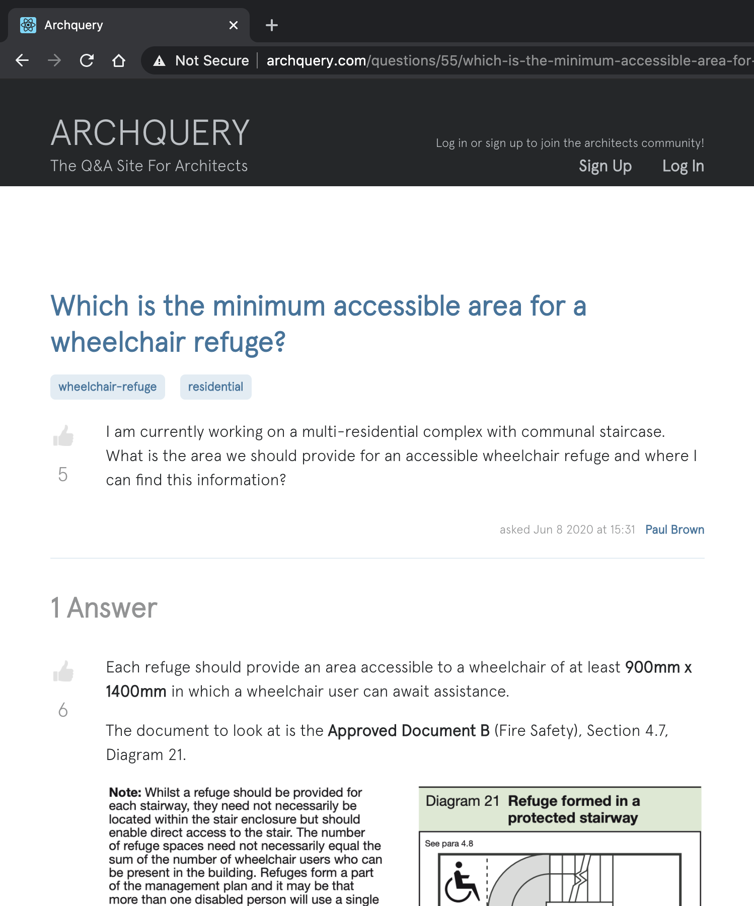

[](https://circleci.com/gh/AndreaDiotallevi/archquery)

# ArchQuery

[Description](#description) | [Live Website](#live-website) | [Technologies Used](#technologies-used) | [Challenges and Goals](#challenges-and-goals) | [Getting Started](#getting-started) | [How to Run the App](#how-to-run-the-app) | [How to Setup the Local Database](#how-to-setup-the-local-database) | [How to Run the Tests](#how-to-run-the-tests) | [Continuous Integration and Delivery](#continuous-integration-and-delivery) | [Design Approach](#design-approach) | [Database Schema](#database-schema) | [Next Tasks](#next-tasks)

## Description

This is a full-stack application built with Node, Express, PostgreSQL, React and Redux that lets architects ask, respond and vote questions like software engineers do on [Stack Overflow](https://stackoverflow.com/).

## Live Website

The application is deployed with custom domain at [http://www.archquery.com](http://www.archquery.com/).

|                  Home Page                  |                  Question Page                  |
| :-----------------------------------------: | :---------------------------------------------: |
|  |  |

## Technologies Used

- Main technologies:

  - [Node](https://nodejs.org/en/): a JavaScript runtime built on Chrome's V8 JavaScript engine I used to write JavaScript code on the server side.
  - [Express](https://expressjs.com/): a fast, unopinionated, minimalist web framework for Node.js I used to get, post and patch the albums information from / to the PostgreSQL database and the React single page app.
  - [PostgreSQL](https://www.postgresql.org/): the world's most advanced open source relational database.
  - [Redis](https://redis.io/): an open source (BSD licensed), in-memory data structure store, used as a session storage.
  - [Amazon S3](https://aws.amazon.com/s3/): object storage built to store and retrieve users image uploads.
  - [React](https://reactjs.org/): a JavaScript library I used to build the user interface and gather data from the Express and external APIs.
  - [Redux](https://redux.js.org/): a predictable state container for JavaScript apps.
  - [CSS Flexbox](https://developer.mozilla.org/en-US/docs/Web/CSS/CSS_Flexible_Box_Layout/Basic_Concepts_of_Flexbox): a flexible box layout module I used to design flexible responsive layout structure without using float or positioning.
  - [Sass](https://sass-lang.com/): a CSS pre-processor I used for writing more maintainable CSS code, using variables, nested rules and inline imports.

- Testing frameworks:
  - [Jest](https://jestjs.io/): a JavaScript Testing Framework with a focus on simplicity.
  - [Enzyme](https://www.npmjs.com/package/enzyme): a JavaScript Testing utility for React that makes it easier to test the React Components' output.
  - [Supertest](https://www.npmjs.com/package/supertest): a npm package that gives you get the ability to send GET, POST, PUT, PATCH and DELETE requests.

## Challenges and Goals

- Build a full-stack application with Node, PostgreSQL, Express, Redis, React and Redux.
- Implement PostgreSQL without the use of any ORM or query builders like Sequelize or Knex.
- Implement authentication with [passport.js](http://www.passportjs.org/).
- Implement Redis for session storage and persistent authentication.
- Implement AWS S3 to store in real-time text editor image uploads from the users.
- Manage a complex tree of React Components with clean code and decoupled testing.
- Research and study the Stack Exchange [database schema](https://meta.stackexchange.com/questions/2677/database-schema-documentation-for-the-public-data-dump-and-sede).
- Deploy to Heroku a full-stack application with PostgreSQL and Redis add-ons.
- Implement the CKEditor (text editor) instead of a textarea to allow users to post rich, formatted content.
- Use React Helmet module to add metadata to each page for SEO and discoverability.
- Learn and use Sass to write better and more maintainable CSS.

## Getting Started

- Clone this repository and change into it
- Install [Node.js](https://nodejs.org/en/download/)
- Install [Redis](https://redis.io/topics/quickstart)
- Install [PostgreSQL](https://www.postgresql.org/)
- Install all the back-end dependencies with `npm install`
- Install all the front-end dependencies with `npm run client-install`

## How to Run the App

- To start the Redis server, on a separate terminal, type `redis-server`
- To start the Express server type `npm run server`
- To start the React server type `npm run client`
- To start both servers concurrently type `npm run dev`

## How to Setup the Local Database

- Type `psql postgres` to start the PostgreSQL command line interface
- Open the `database.sql` file located in the root directory and run all commands in the terminal
- Quit the command line interface with `\q`
- Create a `.env` file in the root directory with the following credentials (replace <...> with your unique values):

  ```
  PG_USER = <your_username>
  PG_PASSWORD = <your_password>
  PG_HOST = localhost
  PG_PORT = 5432
  PG_DATABASE = archquery
  SECRET_KEY = <secret_key>
  ```

## How to Run the Tests

- To run all the express API endpoints tests type `npm test`
- To run all the React components tests type `npm run client-test`

## Continuous Integration and Delivery

[CircleCI](https://circleci.com/) is used for automating the development process quickly, safely, and at scale.

- When a branch is pushed to GitHub, all tests are run within a container, to ensure code quality

- When the master branch is pushed to GitHub, Heroku deploys automatically is no automated test fails

## Design Approach

<p align="center">
  </img>
</p>

## Database Schema

<p align="center">
  <a href="https://drawsql.app/andrea-diotallevi/diagrams/archquery">
    </img>
  </a>
</p>

## Next Tasks

- Implement proper database creation and migration for collaboration and testing
- Complete API endpoint testing
- Build user profile page with options to upload image and personal details
- Implement comments feature for questions and answers
- Add service for dynamic implementation of user avatar image
- Implement service for counting views for each question page
- Move application to AWS Elastic Beanstalk
